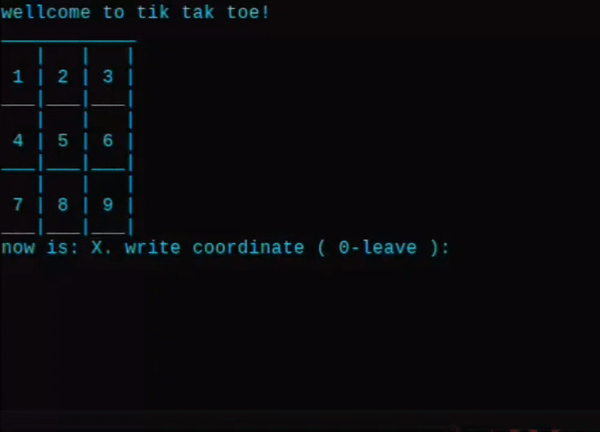

# TicTacToe-in-terminal

Here is my minigame that i make without any libraries

<b>just a normal Tic Tac Toe on Python</b>

# Gameplay:

### Description
X and O here one by one playing, You can play with your friends like someone chose a coordinates and write a number of that and there will write X or O 

So for play just write a number 1 - 9

# How to install: 

### just download a python code and run it on terminal or IDE where can run Python codes ^^